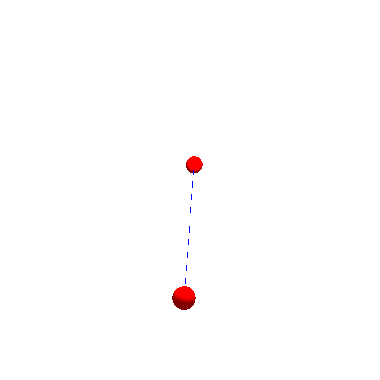

# exercise_mass_spring
it's a course project for "Physics Simulation for Computer Graphics"

## Env

I use python3.8 environment with taichi 1.4.1.

## Results

I implemented explicit euler, implicit euler, symplectic euler, and explicit midpoint method.
Since implicit midpoint method is the same as implicit euler with half timesteps, I haven't implement it for this time.

To run the code, simply run ``` python mass_spring_main.py ```.

I setup some args to switch the mode, ``` python mass_spring_main.py --mode implicit``` would give the result of implicit euler. Similiarly, ```--mode [explicit/midpoint/symplectic]``` would give the results under different mode respectively.

### Demo 1

The output is

(midpoint)
```
position of p0: [-0.1   0.02  0.  ]
position of p1: [0.1        1.98000002 0.        ]
velocity of p0: [-0.97997504  0.40049911  0.        ]
velocity of p1: [ 0.97997504 -0.40049911  0.        ]
```

(Explicit)
```
position of p0: [-0.1   0.02  0.  ]
position of p1: [0.1        1.98000002 0.        ]
velocity of p0: [-0.97997504  0.40049911  0.        ]
velocity of p1: [ 0.97997504 -0.40049911  0.        ]
```

### Demo 2

<p align="center">
    
</p>

### Demo 3

<p align="center">
    
</p>
